# OBV Gestion — Document d'architecture

Version 1.0 — septembre 2026

Ce document décrit l'architecture logicielle d'OBV Gestion : le découpage en
modules, le sens des dépendances entre eux, et la façon dont ils collaborent
pour exécuter une opération métier. Il s'adresse à toute personne qui doit
intervenir dans le code sans en connaître l'histoire.

Le comportement fonctionnel attendu (règles de gestion RG-01 à RG-36) fait
l'objet d'un document distinct : `docs/specification.md`.

---

## 1. Vue d'ensemble

OBV Gestion est une application web à deux tiers : une application monopage
Angular, et une API REST Spring Boot qui porte l'intégralité de la logique
métier. Aucun traitement métier n'est réalisé côté navigateur.

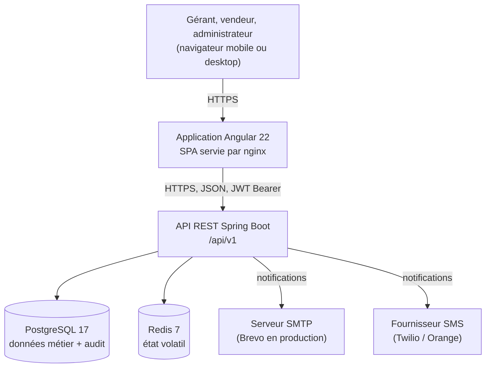

| Élément | Rôle |
|---|---|
| Application Angular | Interface utilisateur, navigation, validation de surface, rendu des écrans. |
| API REST | Authentification, règles de gestion, cohérence du stock, génération des documents PDF. |
| PostgreSQL | Source de vérité : référentiel, documents, stock, journal des mouvements, historique d'audit. |
| Redis | État volatil et reconstructible : paniers, codes OTP, jetons de rafraîchissement, compteurs de tentatives. |
| SMTP / SMS | Sortie des notifications, découplée par une file en base (voir §7.2). |

---

## 2. Le principe directeur : une dépendance à sens unique

Le backend est découpé en cinq modules Maven. La règle qui les organise tient
en une phrase : **les dépendances pointent toujours vers le métier, jamais
l'inverse.**

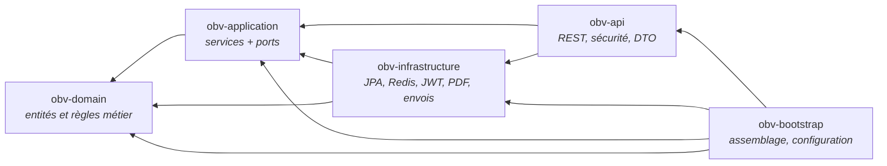

Conséquence pratique : `obv-domain` ne connaît ni la base de données, ni le
web, ni Redis. On peut changer PostgreSQL pour autre chose, ou exposer une
interface autre que REST, sans toucher une ligne de règle métier.

> **Nuance à connaître.** Le domaine n'est pas totalement isolé de toute
> technique : les 28 entités métier portent leurs annotations de mapping JPA
> (`@Entity`, `@Audited`). C'est un choix pragmatique — il évite d'entretenir
> un second jeu de classes de persistance et leur traduction. En contrepartie,
> le domaine dépend de `jakarta.persistence-api` et d'`hibernate-envers`. Ce
> qui reste strictement exclu du domaine : Spring, le web, Redis, et tout
> accès aux données, qui passe systématiquement par un port.

---

## 3. Les cinq modules

| Module | Rôle | Contenu | Dépend de |
|---|---|---|---|
| **obv-domain** | Le métier, indépendant de toute infrastructure. | 75 classes : 28 entités, énumérations, objets valeur (`Montant`, `CodeOtp`, `JetonOpaque`), 19 exceptions métier. | — |
| **obv-application** | Orchestration des cas d'usage et définition des besoins techniques. | 20 services, 29 ports (interfaces). | domain |
| **obv-infrastructure** | Réalisation technique des ports. | 36 adaptateurs : JPA, Redis, JWT, PDF, notifications. | application, domain |
| **obv-api** | Exposition HTTP. | 20 contrôleurs REST, DTO, filtres de sécurité, gestion d'erreurs. | application, infrastructure |
| **obv-bootstrap** | Assemblage et démarrage. | Classe `main`, profils de configuration, 34 changesets Liquibase. | tous |

### 3.1 obv-domain — le cœur

Organisé par sous-domaine métier, sans couche technique :

```
domain/
├── commun/         Montant, JetonOpaque, Hachage, exceptions de base
├── utilisateur/    Utilisateur, Affectation, JetonActivation, CodeOtp, Permission
├── referentiel/    Marque, Volume, Produit, Conditionnement, Tarif, Client…
├── stock/          Stock, MouvementStock, MouvementDemande
├── reception/      Reception, LigneReception, JetonValidationReception
├── vente/          SessionVente, Vente, LigneVente, Panier, CompteurDocument
├── transfert/      BonTransfert, LigneTransfert
├── bar/            TicketServeur, LigneTicketServeur
├── notification/   NotificationOutbox, CanalNotification
└── audit/          Auditable, JournalAction
```

Les règles de gestion vivent **dans les entités**, pas dans les services. Par
exemple, `Reception.cloturer()` refuse une réception qui n'est pas au statut
brouillon, et `SessionVente.valider()` vérifie ses propres préconditions. Les
services ne font que les enchaîner.

### 3.2 obv-application — les cas d'usage et les ports

Ce module contient deux choses de nature différente :

- **20 services** (`ReceptionService`, `VenteService`, `StockService`…) qui
  orchestrent un cas d'usage complet et portent la frontière transactionnelle ;
- **29 ports**, de simples interfaces Java qui expriment *ce dont le métier a
  besoin*, sans dire comment le fournir.

C'est ce second point qui rend l'inversion de dépendance possible :
`obv-application` déclare `StockRepository`, et c'est `obv-infrastructure` qui
vient s'y brancher.

### 3.3 obv-infrastructure — les adaptateurs

Chaque port a exactement une réalisation, rangée par technologie :

| Paquet | Ce qu'il branche | Technologie |
|---|---|---|
| `persistence/` | 22 dépôts de données + audit | Spring Data JPA / PostgreSQL |
| `redis/` | panier, OTP, refresh tokens, compteurs de tentatives | Redis |
| `securite/` | émission de jetons, hachage des mots de passe | JJWT, Argon2id |
| `notification/` | envoi email et SMS, relance de la file | Spring Mail, Thymeleaf, Twilio/Orange |
| `pdf/` | bon de commande, facture, tickets | générateur PDF |

### 3.4 obv-api — l'exposition HTTP

20 contrôleurs sous `/api/v1`, un par ressource métier. Le module ne contient
**aucune règle de gestion** : il traduit du HTTP en appels de service, et des
exceptions métier en réponses normalisées.

### 3.5 obv-bootstrap — l'assemblage

Le seul module qui connaît tout le monde. Il porte la classe `main`, les
profils `dev` / `prod` / `test`, le schéma Liquibase et l'amorçage du premier
super administrateur.

---

## 4. Le mécanisme port / adaptateur

C'est la pièce à comprendre pour lire le reste du code. Prenons le stock :

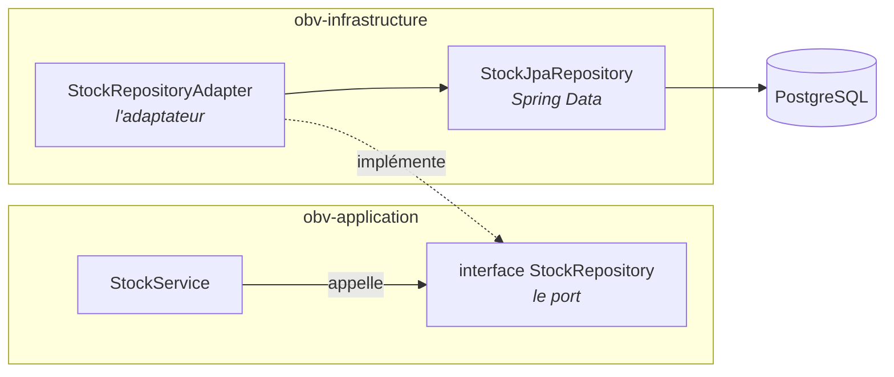

`StockService` ne connaît que l'interface. Au démarrage, Spring injecte
l'adaptateur. Le service reste testable sans base de données, et l'adaptateur
peut être remplacé sans rien changer au métier.

### 4.1 Les 29 ports, par famille

| Famille | Ports | Adaptateur | Support |
|---|---|---|---|
| Référentiel | `MarqueRepository`, `VolumeRepository`, `ProduitRepository`, `ConditionnementRepository`, `FournisseurRepository`, `ClientRepository`, `ServeurRepository`, `PointDeVenteRepository`, `TarifRepository` | `*RepositoryAdapter` | PostgreSQL |
| Documents | `ReceptionRepository`, `VenteRepository`, `SessionVenteRepository`, `BonTransfertRepository`, `TicketServeurRepository`, `CompteurDocumentRepository` | `*RepositoryAdapter` | PostgreSQL |
| Stock | `StockRepository`, `MouvementStockRepository` | `*RepositoryAdapter` | PostgreSQL |
| Utilisateurs | `UtilisateurRepository`, `JetonActivationRepository`, `JetonValidationReceptionRepository` | `*RepositoryAdapter` | PostgreSQL |
| Sécurité | `EmetteurAccessToken`, `HacheurMotDePasse` | `JwtTokenProvider`, `HacheurMotDePasseAdapter` | JJWT, Argon2id |
| État volatil | `PanierRepository`, `GestionnaireOtp`, `GestionnaireRefreshToken`, `LimiteurConnexion` | `PanierRepositoryAdapter`, `OtpStore`, `RefreshTokenStore`, `TentativesConnexionStore` | Redis |
| Sorties | `NotificationService`, `DocumentVentePdfGenerator`, `Journalisateur` | `NotificationServiceAdapter`, `DocumentVentePdfGeneratorImpl`, `JournalisateurAdapter` | file en base, PDF, PostgreSQL |

Un port n'est jamais une copie d'une API technique : `LimiteurConnexion`
exprime « compter les échecs et verrouiller », pas « incrémenter une clé
Redis ». C'est ce qui permet d'en changer l'implémentation.

---

## 5. Les interactions entre modules métier

C'est le point central : **comment les services collaborent**. Le graphe
ci-dessous ne montre que les dépendances entre services (les dépôts de données
sont omis pour rester lisible).

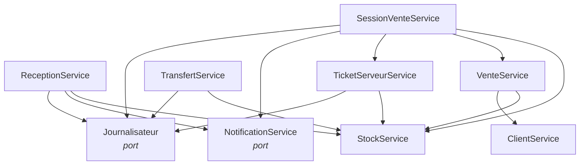

Trois observations structurent la lecture du code :

**1. `StockService` est le point de convergence.** Cinq services l'appellent,
et il est le **seul** à écrire dans la table `stock`. Toute variation de stock,
quelle qu'en soit l'origine, passe par sa méthode `appliquer(...)`, qui
enregistre dans le même mouvement la nouvelle valeur du solde et la ligne du
journal (RG-14). C'est ce goulot volontaire qui garantit l'invariant « solde =
somme des mouvements ».

**2. `SessionVenteService` agrège.** À la clôture, il a besoin des ventes du
dépôt (`VenteService`) et des tickets du bar (`TicketServeurService`) pour
produire le récapitulatif. C'est la seule dépendance entre deux services de
processus.

**3. Les services de processus ne se connaissent pas.** `ReceptionService`,
`TransfertService` et `VenteService` s'ignorent mutuellement. Ils ne
communiquent qu'indirectement, à travers l'état du stock. Ajouter un nouveau
processus métier ne demande donc de modifier aucun des trois.

### 5.1 Qui écrit quoi

| Service | Écrit dans | Lit |
|---|---|---|
| `StockService` | `stock`, `mouvement_stock` | — |
| `ReceptionService` | `reception`, `ligne_reception` | référentiel, tarifs, utilisateurs |
| `VenteService` | `vente`, `ligne_vente`, `compteur_document` | panier, session, référentiel, tarifs |
| `SessionVenteService` | `session_vente` | ventes, tickets, stock |
| `TransfertService` | `bon_transfert`, `ligne_transfert` | référentiel, tarifs, stock |
| `TicketServeurService` | `ticket_serveur`, `ligne_ticket_serveur` | session, serveurs, tarifs |
| `PanierService` | Redis uniquement | référentiel, tarifs |

Aucun service n'écrit dans une table dont un autre est propriétaire. Cette
règle est ce qui rend les frontières transactionnelles sûres.

---

## 6. Traversée complète d'une requête

### 6.1 Clôture d'une réception

Le cas le plus représentatif : il traverse les cinq modules et déclenche un
mouvement de stock.

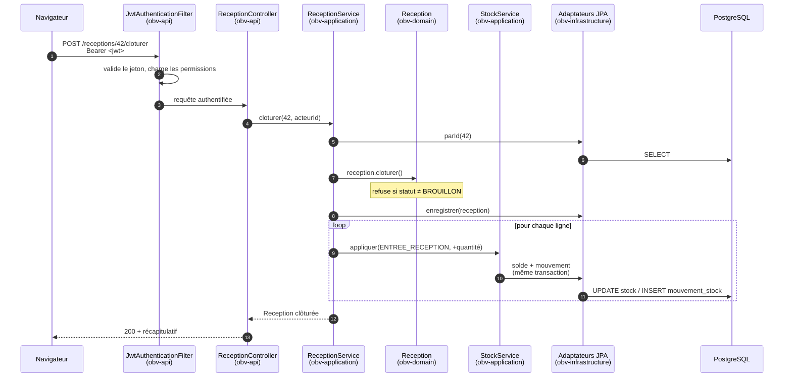

Points à retenir :

- La règle « on ne clôture qu'un brouillon » est portée par l'entité, pas par
  le contrôleur ni par le service.
- Le stock est incrémenté **dès la clôture**, pas à la validation (RG-17).
- Le solde et le journal sont écrits dans la même transaction (RG-14).

### 6.2 Passage d'une commande

Ce parcours illustre trois mécanismes transverses : l'idempotence, la
numérotation des documents et le contrôle de stock bloquant.

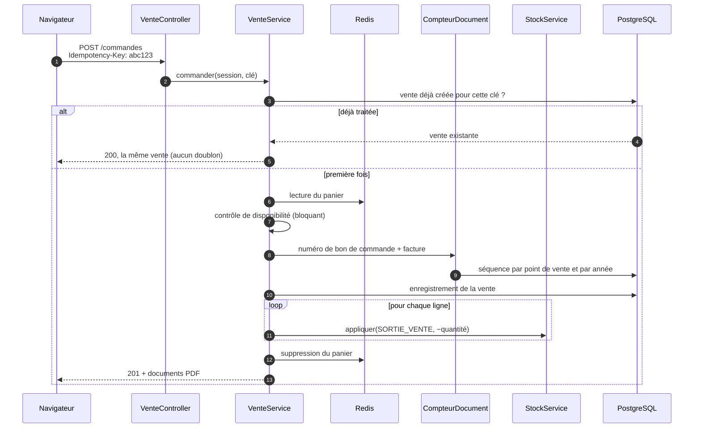

Le panier vit dans Redis et n'est **pas** un document : le supprimer n'a aucun
effet sur le stock (RG-25). Il ne devient une donnée durable qu'au moment de la
commande.

### 6.3 Authentification et activation

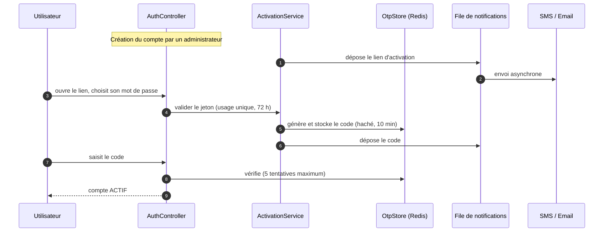

---

## 7. Les mécanismes transverses

### 7.1 Sécurité

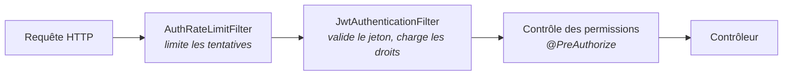

- Session **sans état** : aucun cookie de session, un jeton d'accès de courte
  durée et un jeton de rafraîchissement stocké dans Redis, donc révocable.
- Le rate limiting précède l'authentification : une attaque par force brute est
  arrêtée avant tout accès à la base.
- CORS restreint à l'origine du frontend, configurée par variable
  d'environnement.

### 7.2 Notifications : la file en base

Un envoi d'email ou de SMS ne doit jamais faire échouer une opération métier.
Le découplage passe par une file persistée :

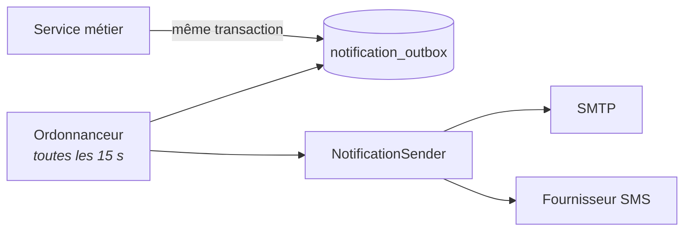

Le service métier se contente d'écrire une ligne dans la file, dans sa propre
transaction. Un processus séparé la relit et procède à l'envoi, avec trois
tentatives. Si le serveur SMTP est indisponible, la réception reste clôturée.

Le fournisseur SMS est choisi par configuration (`log`, `twilio`, `orange`) :
aucun n'est codé en dur.

### 7.3 Concurrence sur le stock

Deux ventes simultanées du même produit ne doivent pas se perdre. Le mécanisme
combine un verrou optimiste sur l'entité `Stock` (champ `@Version`) et un
rejeu automatique : en cas de conflit, l'opération est relancée jusqu'à trois
fois avant de renvoyer une erreur (RG-16). Au-delà, ou si le stock est
réellement insuffisant, la requête est rejetée en `409 Conflict` (RG-15).

### 7.4 Traçabilité

Trois dispositifs se superposent :

| Dispositif | Portée | Usage |
|---|---|---|
| JPA Auditing | toutes les entités | qui a créé, qui a modifié, quand |
| Hibernate Envers | 8 entités sensibles | historique complet des versions successives |
| `journal_action` | opérations sensibles | validation, annulation, changement de droits, avec valeurs avant/après |

Aucune donnée transactionnelle n'est jamais supprimée : les corrections passent
par contre-passation ou document d'ajustement.

---

## 8. Architecture du frontend

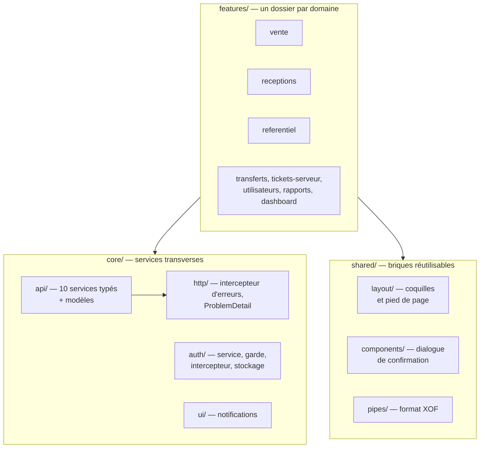

- **Angular 22**, composants autonomes, état par signaux, mode *zoneless*,
  nouvelle syntaxe de contrôle de flux.
- `core/api/` expose un service typé par domaine ; aucun composant n'appelle
  `HttpClient` directement.
- L'intercepteur d'authentification ajoute le jeton et rejoue la requête après
  rafraîchissement ; l'intercepteur d'erreurs traduit les réponses normalisées
  du backend en messages français.
- Les routes sont protégées par des gardes fondées sur les permissions
  renvoyées à la connexion. Une route demandée sans être connecté est mémorisée
  puis rejouée après authentification (RG-35).

---

## 9. Répartition des données

Le choix du support obéit à une question simple : **peut-on perdre cette
donnée sans conséquence métier ?**

| Donnée | Support | Justification |
|---|---|---|
| Référentiel, documents, stock, mouvements, audit | PostgreSQL | Source de vérité, doit survivre à tout redémarrage. |
| Panier en cours | Redis (4 h) | Reconstructible par l'utilisateur ; n'est pas un document. |
| Code OTP | Redis (10 min) | Éphémère par nature, ne doit pas laisser de trace. |
| Jeton de rafraîchissement | Redis | Doit pouvoir être révoqué instantanément. |
| Compteur de tentatives de connexion | Redis | Fenêtre glissante, sans valeur historique. |

Le schéma PostgreSQL est géré par **Liquibase** (34 changesets ordonnés).
Hibernate est configuré en `validate` : il ne crée ni ne modifie jamais une
table. Toute évolution de schéma passe par un nouveau changeset, ce qui rend
les déploiements reproductibles et réversibles.

---

## 10. Déploiement

### 10.1 Développement

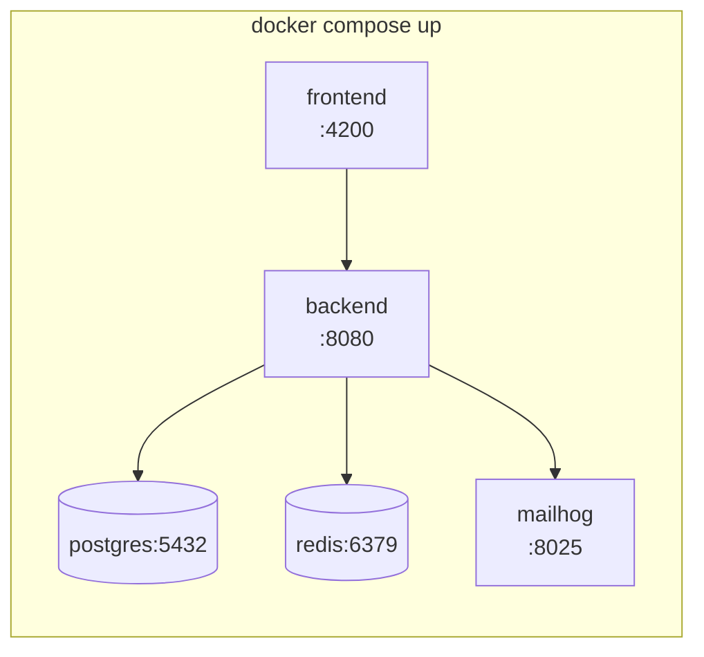

MailHog capture les emails : aucun message ne part réellement, et le contenu
est consultable dans un navigateur.

### 10.2 Production

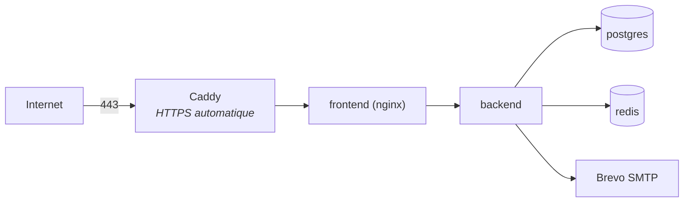

Seul Caddy est exposé ; les autres conteneurs restent sur le réseau interne.
Les secrets sont fournis par variables d'environnement, avec une syntaxe qui
fait échouer le démarrage si une valeur manque. Un chart Kubernetes est
également disponible dans `k8s/` (sondes de vitalité, autoscaling, budget de
disruption).

---

## 11. Ajouter une fonctionnalité : la traversée type

Pour situer rapidement où intervenir, voici l'ordre dans lequel les couches se
modifient lorsqu'on ajoute un cas d'usage — par exemple un inventaire physique :

1. **`obv-domain`** — créer l'entité `Inventaire` et ses règles (statuts,
   transitions autorisées, calcul de l'écart).
2. **`obv-application`** — déclarer le port `InventaireRepository`, écrire
   `InventaireService`, qui appellera `StockService` pour l'ajustement.
3. **`obv-infrastructure`** — écrire `InventaireRepositoryAdapter` et son dépôt
   Spring Data.
4. **`obv-bootstrap`** — ajouter le changeset Liquibase de la table.
5. **`obv-api`** — exposer `InventaireController` et ses DTO.
6. **`frontend`** — ajouter le service d'appel dans `core/api/`, puis l'écran
   dans `features/`.

L'ordre a son importance : chaque étape ne dépend que des précédentes. Si on
commence par le contrôleur, on écrit du code qui ne compile pas encore.

---

## Annexe — Repères chiffrés

| | |
|---|---|
| Modules Maven | 5 |
| Classes du domaine | 75, dont 28 entités et 19 exceptions métier |
| Services applicatifs | 20 |
| Ports (interfaces) | 29 |
| Adaptateurs | 36 |
| Contrôleurs REST | 20 |
| Changesets Liquibase | 34 |
| Composants Angular | 28 |
